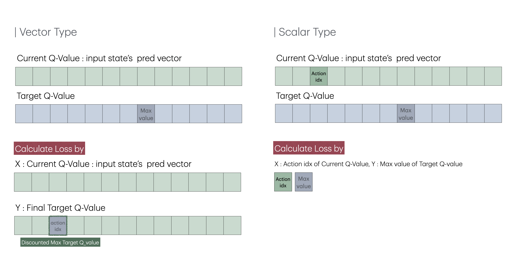
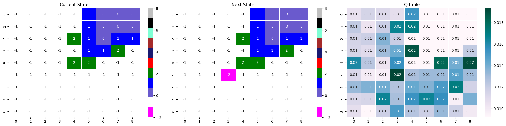
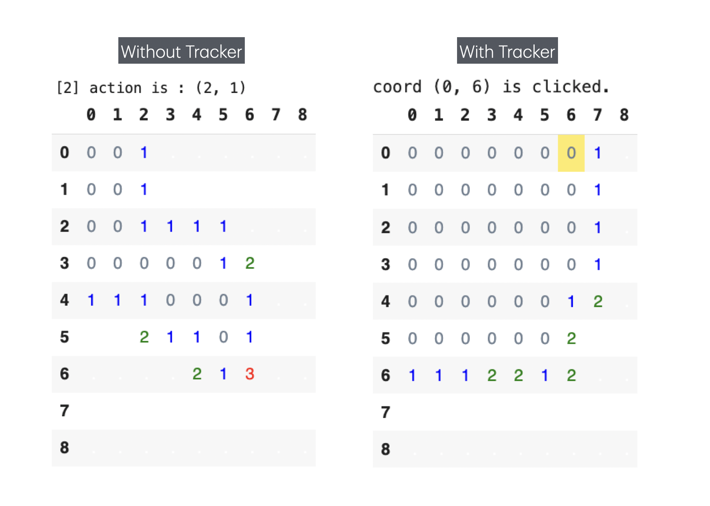

# Development Log
## Contents
01 | [Env](#01-env)  
02 | [Agent](#02-agent)  
03 | [Net](#03-net)  
04 | [Train & Valid](#04-train--valid)  
05 | [Visualization](#05-visualization)  
06 | [Tester](#06-tester)  
07 | [Etc](#07-etc)  
08 | [Reference](#referrence)

## 01 Env
| 날짜 | 문제 상황 | 해결 | 
| -- | -- | -- | 
| 3월 말 - 4월 초 | 레퍼런스 코드가 비효율적이라 판단 | 리펙토링 진행 |
|  | reward가 제대로 들어오지 않을 때 오류 발생 |  |
|  | no_progress 보상 사용시 무한 에피소드 발생 |  |

### 1. 레퍼런스 -> 자체 코드 

레퍼런스 코드에서 비효율적인 부분 및 잘못된 보상 체계를 발견했다. 시간 효율적, 가독성이 높은 코드로 작성하고자 했다. 

1. **reward 고정된 파라미터로 부여**
    
    클래스 내부를 수정하는 것보다 파라미터로 받는 것이 낫다고 판단 후 수정
2. **Mine seeding 방법 수정**

    랜덤으로 위치를 뽑아 지뢰가 이미 있다면 넘어가고, 없다면 배치하는 코드 -> 판을 flatten시켜 easy 기준 81개의 숫자 중 랜덤으로 10개를 뽑은 후 board 규격으로 복구 
3. **상황 표현 단순화**

    레퍼런스를 참고한 초기 코드에서는 게임 판인 grid, 현재 상태를 알려주는 state_info, 신경망에 들어가는 state_img로 분리되어 있었다. 이 표현 방식이 코드의 복잡성을 높이고, 가독성을 떨어트린다 판단해 board와 state로 표현을 단순하게 만들었다. board는 grid와 state_info의 역할을 수행한다. 첫 번째 레이어는 타일의 reveal 상태를 알려주고, 두 번째 레이어는 기저의 판을 나타낸다(M과 숫자로 표현). 기존에는 state_info를 이용해 state_img를 추출했으나, board에서 state를 생성한다. unreveal 값을 -1로 표현하는 기존 state 표현 방식을 유지하기 위해서 `np.ma.masked_array` 기능을 익혀 적용했다.
4. **판 채우기 단순화**

    '주변에 몇 개의 지뢰가 존재하는가' 구현을 기존에는 각 타일의 주변부 타일 수집 -> sum과 boolean masking을 통해 개수 확인 -> 채워넣기 순으로 구현했다. 이 코드를 패딩과 커넬 아이디어를 이용해 단순화시켰다. 판에 1 두께 0 패딩한 객체 생성 -> 기존의 판을 탐색하며 지뢰가 아닌 부분은 현 위치를 중심으로 패딩한 객체에서 3*3 커넬을 뽑아 sum과 boolean masking을 통해 값을 넣는다. 
5. **0 연쇄작용 무한 루프 문제 해결**
    
    기존 코드에서는 누른 타일이 0이었을 때 주변 타일이 까지는 기능을 재귀형으로 구현했다. 이 코드는 논리적 이상을 발견하지 못했지만, 자주 무한 루프에 빠져 time.sleep() 기능을 통해 시간 텀을 줘야했다. BFS를 적용해 시간 복잡도를 낮추고 무한 루프 문제를 해결했다. 
6. **잘못된 reward 코드 수정**

    기존 코드에서는 get_neighbor 매소드로 주변부 타일을 훑어 guess reward를 주었다. 하지만 이 매소드는 grid를 통해 주변부 타일의 값을 받기 때문에 까졌는지를 판단하지 못했다. 이 부분에서 오류를 발견하고, board의 첫 번째 레이어 + 패딩 + 커넬 + 불리언 마스킹을 사용해 문제를 해결했다. 

### 02. reward가 제대로 들어오지 않을 때 오류 발생
다양한 조건으로 학습을 시키다보니 reward 체계가 다른데 같은 보상 값을 파라미터 값으로 지정하는 실수가 잦다. 

## 02 Agent
| 날짜 | 문제 상황 | 해결 | 
| -- | -- | -- | 
| 3월 -  | 에피소드를 병렬로 돌리고 싶음 | batched agent 구현 |
| 4월 -  | vector 기준 DQN 구현이 비효율적이라 판단 | 단일 값을 이용하는 DQN 생성 |
| 4/14 | 기존의 get_action 코드는 하드 코딩으로 이미 까진 타일을 제외시킴 | 하드 코딩을 없앤 버전 작성 |
| 5/14-18 | 기존의 vector type Agent는 for문을 이용해 값을 조정했다. | for문을 없애 속도 개선 |

### 01. Batched Agent 구현
LLM에서 아이디어를 얻어, 에피소드를 병렬로 구현하면 더 많은 데이터를 짧은 시간 내에 저장할 수 있지 않을까 생각했다. 

1. **BATCHED DATA 구현**
    
    BATCH_SIZE의 에피소드를 map 함수를 이용하기 위해 list에 넣고 적용했다. 
2. **길이가 다른 에피소드 관리**

    에피소드가 종결 이후에도 돌아가는 경우를 대비해 state와 reward를 -inf 값으로 할당해 종결된 무의미한 데이터임을 나타냈다. 

- 2번의 리펙토링을 거쳐 속도 개선이 이루어졌지만, 단일 케이스를 사용하는게 더 빨라서 사용하지는 않고 있다. (5/4 기준)

### 02. 단일 값 비교 DQN 구현 
기존의 DQN Agent는 Q-table 전체를 loss 계산에 이용했다. 이는 이론적으로도 덜 직관적이고, for문으로 reward를 일일이 넣어줘야 하기에 비효율적이며, pytorch DQN 또한 scalar 값을 비교하는 방식을 채택하고 있기 때문에 scalar 타입 DQN을 구현했다. 

- 두 DQN은 MSE Loss를 채택했을 때 scalar 타입이 더 높은 loss 값을 갖는다는 차이가 있다. 
- scalar DDQN까지 구현해놨는데... scalar로는 학습이 되지 않아 사용하지 못하고 있다. (5/4 기준)
- scalar 버전에서 index를 꺼내오는데 오류가 있었다. 첫 번째 Q-table에서 모든 action 값을 꺼내왔다. 이 문제를 해결한 후 학습을 돌리니, 전과 달리 학습이 가능해졌다. 다만, 벡터 타입과 비교했을 때 학습 속도 면에서나 수렴 면에서나 떨어지는 성능을 보이고 있다. 

### 03. Rule이 없는 Agent
기존에는 하드 코딩으로 까진 타일의 Q값을 최소값으로 낮춰 강제로 선택하지 못하게 만들었다. 이 규칙을 없앤 버전이 withoutRules 버전이다. 

### 04. for문 없는 vector type Agent
기존 vector Agent는 for문을 이용해 값을 바꾸고, 같은 벡터를 다시 신경망에 넣었다. 이런 코드 상의 비효율성을 개선하고자 `newVectorDQN` code를 만들었다. 

## 03 Net
| 날짜 | 문제 상황 | 해결 | 
| -- | -- | -- | 
| 3/6 | 학습이 전혀 안됨 | padding을 추가 |
| 3/8 |  | fc 영역 삭제, 합성곱만 사용 |
| 4월 - |  | ResNet |
| 5/4 |  | bias=False |

### 01. Padding을 추가
레퍼런스를 보며 코드를 구현했음에도 학습이 전혀 되지 않았다. 이는 케라스 코드가 익숙치 않아 발생한 문제로, 케라스로 작성된 레퍼런스 코드에서 합성곱 신경망의 same이란 조건을 빠트려 생긴 문제였다. padding을 각 레이어에 추가해주니 학습이 가능해졌다. 
- **padding의 기능**
    - 이미지 크기 손실을 막는다. 
    - 가장자리를 더욱 잘 인식시켜준다. 

### 02. fc layer 삭제, 합성곱 신경망만 사용
1. https://github.com/AlexMGitHub/Minesweeper-DDQN?tab=readme-ov-file
2. https://github.com/ryanbaldini/MineSweeperNeuralNet 

두 레퍼런스를 통해 합성곱 신경망만을 이용하는 아이디어를 얻었다. 그 결과 fc layer을 사용했을 때보다 2배 이상의 성능 차이를 보였다. 

### 03. Resnet
풀링을 사용하지 않았더니 그래디언트 소실 문제가 심화되어 최대 4층의 합성곱 신경망을 사용할 수 밖에 없었다. 더 깊은 신경망을 통해 표현력을 올리고자 ResNet을 적용했다. 
- 10개의 고정된 환경에서 코드를 돌렸을 때에도 학습이 되지만 속도가 느리고, 고정시키지 않은 케이스보다도 acc가 낮았다. 
- 학습이 느리다보니 성과가 났던 no_progress를 사용할 수가 없었다. 
### 04. bias 
resnet을 테스트할 때 bias를 끈 상태에서 학습이 이뤄져서 기본 모델에 적용해봤다. 02만큼의 극적인 변화는 없었지만, 근소하게 더 안정적인 학습이 이뤄졌다. 

## 04 Train  & Valid
| 날짜 | 문제 상황 | 해결 | 
| -- | -- | -- | 
| 4월 말 | 최고 acc를 저장하는 것에서 논리적 오류 존재 | 후반 episode에서 valid 시행 |
| 5/2 | 학습, 시각화, 저장이 따로 따로 분리되어 있음 | 자동 class화 |
| 5/3 | 후반 에피소드에만 valid를 하는 것이 이상함 | train에서 최고 acc 달성 후 valid 시작 |
| 5/5 | valid의 무한 에피소드 문제 | Valid Shut Down Code |
| 5/18 | valid 관련 논리적 오류 | train 중 win한 모델을 저장한 후 valid 시행 |

### 01. 후반 에피소드에서 valid 시행
기존에는 train 중 최고 acc와 가장 마지막 model을 저장했다. 하지만 최고 acc는 매 timestep마다 학습을 진행하는 상황에서 100마다 승률을 구하는 방식이었기 때문에 최고 acc는 실질적으로 최고 acc가 아닐 가능성이 높다. 이 문제를 해결하기 위해 model을 고정시키고 n번의 에피소드를 시행해 주어진 모델의 성능을 측정하는 valid 코드가 후반 에피소드일 때 10 에피소드 단위로 돌아가게 만들었다. 

### 02. 학습, 시각화, 저장 class화 
기존에는 학습, 시각화, 저장을 전부 다른 셀에 분리했다. 하지만 py-ipynb 환경을 오가며 작업하다보니, 셀 단위로 나눠져 있는 것보다 class로 묶는 것이 낫다고 판단했다. 이는 학습을 안정적이게 저장 할 수 있으며, class 단위로 저장할 수 있어 추가적인 notation없이 중간 단위를 학습할 수 있다. 또한 train 시점을 정할 수 있는 것과 같은 편의를 위한 기능을 추가했다. 

### 03. train에서 최고 acc 달성 후 valid 시작 
기존에는 후반 에피소드에 대해 valid를 100개의 샘플로 시행했다. 이 결과 얻은 모델들은 최고 성능과 평균 성능의 괴리가 심했다. (15% 이상 차이)
이 차이에서 최적의 모델을 찾기엔 valid의 시기가 애매하며, 검정을 위한 표본 수가 충분치 않다는 생각이 들었다. 이 문제를 해결하기 위해 valid의 시점을 train에서 최고 acc를 달성한 이후 10개의 에피소드마다 valid를 1000개의 표본으로 돌리는 것으로 문제를 해결했다. 
- valid를 위한 최적의 표본 수가 뭔지 통계적으로 검정(글로 남기기)

### 04. Valid Shut Down Code
후반 에피소드에서만 valid를 진행하는 경우는 이미 학습이 진행되어 까진 타일을 누르지 않아 no_progress + done=False 상황에서도 무한 에피소드 상황에 빠지지 않았다. 하지만 03 형식으로 valid 방식을 바꾼 이후에는 학습 초반에도 valid가 이루어졌기 때문에 쉽게 무한 에피소드 상황에 빠졌다. 이 케이스를 피하기 위해 no_progress + done=True로도 학습을 진행했지만, done=False일 때만큼의 성능이 나오진 않았다. 이 문제를 해결하기 위해 탐험률이 존재해 언젠가는 무한 에피소드 상황에서 탈출할 수 있는 학습 상황에서는 done=False로 두되, 탐험률이 0인 valid에서는 current_state와 next_state가 동일하다면 강제로 에피소드를 중단시키는 Shut Down 코드를 작성해 문제를 해결했다.

-  학습 후반에도 아직 까면 안되는 것을 잘 학습하지 못한 양상을 보인다. 

### 05. train 중 win한 모델을 저장한 후 valid 시행
기존의 valid 방식은 win rate에 실질적으로 관여하는 train 중의 승리를 배제한다. 이 문제를 해결하고자 train 중 승리한 모델을 저장하고, win_rate가 baseline을 넘었을 때 가장 마지막 모델을 추가적으로 valid해 주었다. 

## 05 Visualization 
| 날짜 | 문제 상황 | 해결 | 
| -- | -- | -- | 
| 3월 | 모델의 선택을 보고 싶다. | net의 output(Q테이블) 시각화 |
| 4/3 | 어떤 action의 결과인지 한 눈에 보고 싶다. | pd.style을 이용해 누른 타일에 형광펜 |
| 4/3 | 지뢰를 역추적하기가 너무 어렵다. | plt.scatter을 통해 지뢰 시각화 |

### 01. Q-Table 시각화
모델이 전체 타일 중 어떤 타일을 지뢰가 아니라 판단하는지를 시각화하고 싶었다. agent의 model의 output을 class의 어트리뷰트로 꺼내와 현재 state, 다음 state와 함께 Q-table로 시각화시켰다. 값을 softmax를 이용해 스케일링했다. 

### 02. env.render에서 누른 타일 시각화 
기존 env.render은 누른 타일을 텍스트로만 전달해, 누른 타일을 즉시 파악할 수 없었다. 1차적으로는 좌표로 변환해 문제를 해결했지만, 좌표를 보고 판에 적용해야 했기 떄문에 효과적이지 않았다. 따라서 누른 좌표를 tracker로 사용해 누른 타일에 색을 칠하는 방식으로 문제를 해결했다. 

### 03. 지뢰 시각화 
현재 state, 다음 state, Q-table을 시각화했을 떄 진 게임에서는 누른 지뢰가 마젠타 색으로 나타나 위치를 알 수 있었지만, 전체 지뢰 분포를 알 수 없었기 때문에 불편했다. 이를 문제를 해결하기 위해 heatmap 위에 plt.scatter로 지뢰를 뿌렸다. 또한 Q-table 스케일링 방법을 softmax에서 min-max로 바꾸었다. 

## 06 Tester
| 날짜 | 문제 상황 | 해결 | 
| -- | -- | -- | 
| 4/3 |  | 기본 테스터 코드 |

### 01. 기본 테스터 코드
학습한 모델의 성능을 테스트하기 위해 고정된 환경, 랜덤 환경에서 테스트, 시각화, 이긴 게임과 진 게임 분리, 특정 에피소드 시각화 과정을 담은 클래스를 짰다. 

## 07 etc
| 날짜 | 문제 상황 | 해결 | 
| -- | -- | -- | 
| 5/1 | 작업 내역이 너무 복잡함 | py files와 ipynb 콜라보 feat.패키지화 |

### 01. py + ipynb
여러 케이스를 나누어 작업을 하다보니, 공통 코드가 여러 곳에 퍼져 있어 수정했을 때 일괄적인 적용이 어렵고 전체 코드 길이가 길어져 가독성이 떨어졌다. 이런 문제점을 해결하고자 py file(gdrive local 연결 후 local에서 작업)과 colab을 동시에 사용하는 것으로 작업 방식을 바꾸었다. 

## + Referrence
1. 기본 골격 + 처음 따라한 레퍼런스  
    https://github.com/sdlee94/Minesweeper-AI-Reinforcement-Learning
2. CNN 아이디어를 얻은 레퍼런스  
    https://github.com/AlexMGitHub/Minesweeper-DDQN
3.