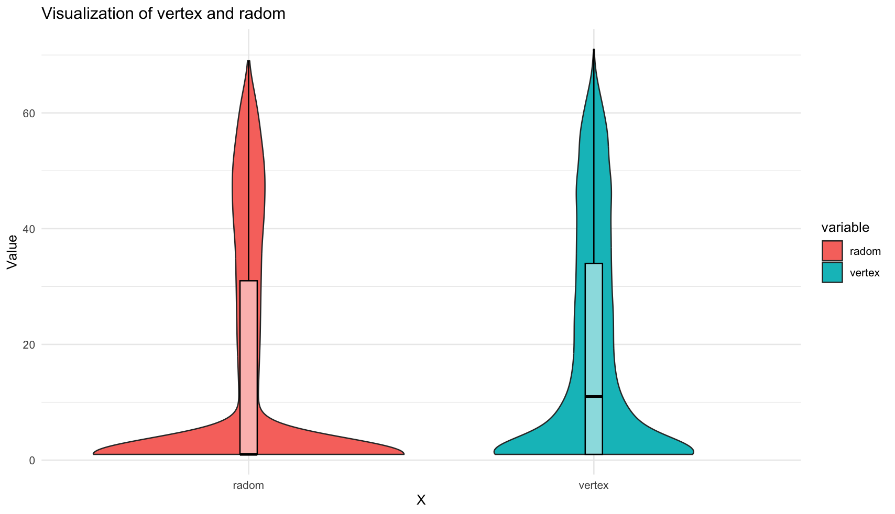
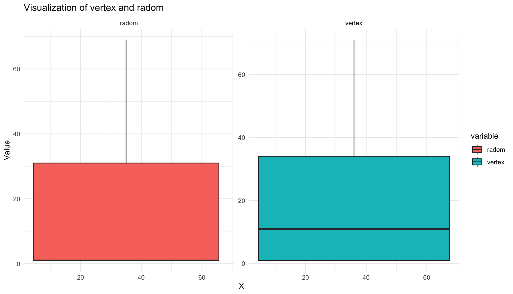
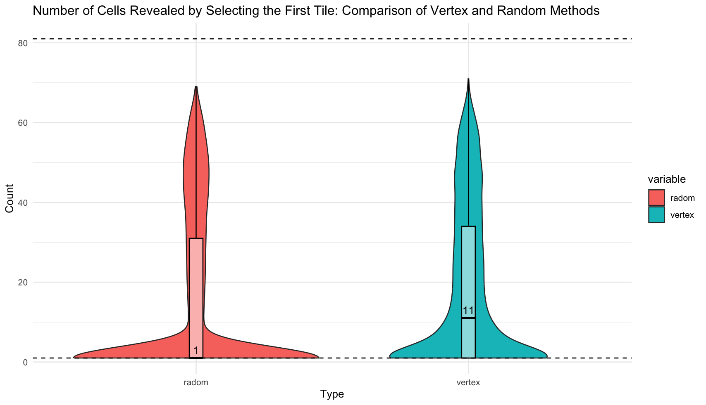

## [RL] MineSweeper
## 00. Overview 


이 프로젝트는 DQN 강화학습 방법론을 사용해 지뢰찾기를 풀어내는 것을 목표로 한다. 
### About Minesweeper 
지뢰찾기는 맵에 깔려있는 모든 지뢰를 찾는 게임이다. '찾는다'는 지뢰라고 판단되는 타일을 건들이지 않는 것이다. 따라서 지뢰찾기의 승리조건은 지뢰가 아닌 나머지 모든 타일을 다 까는 것과 같다. 이 맥락에서 일반적으로 지뢰찾기 게임 내 존재하는 깃발 기능은 필수가 아니다. 깃발은 찾아낸 지뢰를 표시하기 위해 있는 기능이다. 승리조건에 미루어 비춰 볼 때, 깃발은 플레이어의 편의성을 위해 존재하는 기능일 뿐 필수요건은 아니다. 따라서 본 프로젝트에서는 깃발 기능을 구현하지 않고 진행했다.  

지뢰찾기의 난이도는 초급 중급 고급으로 나누어져 있다.  

| Level | Height | Width | Num of Mine | density | 
| - | - | - | - | - | 
| 초급 | 9 | 9 | 10 | 12.3% | 
| 중급 | 16 | 16 | 40 | 15.6% | 
| 고급 | 16 | 30 | 99 | 20.6% | 

구현한 환경으로 커스텀 포함 모든 난이도로 학습이 가능하지만, 본 프로젝트는 초급(9*9, 지뢰 10개)을 기준으로 진행했다.  

### RL 
DQN 방법론을 이용했으며, 구체적인 내용 및 구현은 Ch.03에 기재되어 있다. [@ DeepMind Gym](https://gymnasium.farama.org/api/env/) 스타일을 따라 `step()`, `reset()`, `render()`, `action_space`가 구현되어 있다.  

### 학습 환경 
코랩에서 학습을 진행했다. T4 GPU / L4 GPU / A100 GPU를 사용했고, A100을 기준으로 20만 에피소드(valid 포함) 6시간 25분이 소요됐다. 

### 최고 성능 
> 2024.07.25 기준,  
> 🔥 **Win rate : 0.839 (± 0.037)** 

## Contents
#### 1. [Environoment](#01-environoment)
<table>
  <tr>
    <td><a href="#package">00. Package</a></td>
    <td><a href="#state">01. State</a></td>
    <td><a href="#reward-design">02. Reward Design</a></td>
    <td><a href="#속도-개선">03. 속도 개선</a></td>
    <td><a href="#판이-고정된-환경">04. 판이 고정된 환경</a></td>
  </tr>
</table>

#### 2. [Agent](#02-agent)
<table>
  <tr>
    <td><a href="#행동을-제한하는-규칙">01. 행동을 제한하는 규칙</a></td>
  </tr>
</table>

#### 3. [DQN](#03-dqn)
<table>
  <tr>
    <td><a href="#net">01. Net</a></td>
    <td><a href="#replay-memory">02. Replay Memory</a></td>
    <td><a href="#dqn-로직-구현">03. DQN 로직 구현</a></td>

  </tr>
</table>

#### 4. [Train / Valid / Test](#04-train--valid--test)
<table>
  <tr>
    <td><a href="#train--학습-지표-선택">01. Train : 학습 지표 선택 </a></td>
    <td><a href="#valid의-중요성">02. Valid의 중요성</a></td>
    <td><a href="#valid에서-적절한-표본-수">03. Valid에서 적절한 표본수</a></td>
  </tr>
</table>

#### 5. [Trials](#05-trials)
<table boarder="0">
  <tr>
    <td><a href="#이미-열린-타일을-누르는-행동">01. 이미 열린 타일을 누르는 행동</a></td>
    <td><a href="#주변-타일이-까지지-않은-타일을-선택하는-행동">02. 주변 타일이 까지지 않은 타일을 선택하는 행동</a></td>
  </tr>
  <tr>
    <td><a href="#주요-파라미터">03. 주요 파라미터</a></td>
  </tr>
</table>

#### 6. [Result](#06-result)
<table  boarder="0">
  <tr>
    <td><a href="#test--모델들-성능비교">01. Test : 모델들 성능비교</a></td>
    <td><a href="#최고-성능-모델의-하이퍼-파라미터">02. 최고 성능 모델의 하이퍼 파라미터</a></td>
    </tr>
    <tr>
    <td><a href="#최고-성능-모델의-보상-구조">03. 최고 성능 모델의 보상 구조</a></td>
    <td><a href="#고성능-모델의-공통점--첫-행동으로-지뢰찾기-판의-꼭짓점을-선택한다">04. 고성능 모델의 공통점 </a></td>
    <td><a href="#baseline--rule-base">05. baseline </a></td>
  </tr>
</table>


## 01. Environoment
### Package
``` 
0.0.0
```

### State 
#### 2D type
9*9(easy의 맵 규격)의 arr에 주변부 지뢰의 개수를 센 타일의 수(0-8)를 그대로 반영하고, 아직 까지지 않은 타일을 -1, 지뢰를 -2로 표현했다. 최댓값인 8로 전체 state arr를 나누어 state를 정규화했다. 정규화를 하지 않았을 때엔 학습이 거의 되지 않았지만, 정규화 이후에 승률이 극적으로 상승했다. 


#### 3D type
`env.dim2` 클래스 파라미터에서 False값을 주면 3차원 state를 이용할 수 있다. 3D state는 2D state에서 지뢰(-2), 까짐 여부(-1), 주변 지뢰 개수의 합을 각각의 채널로 받고, 원핫인코딩으로 값을 표현한다. 


### 타입별 학습
<table>
  <tr>
    <td></td>
    <td></td>
  </tr>
</table>
초반 학습에서는 3차원 state를 사용할 때 승률이 더 빠르게 올랐다. 하지만 10만 이후부터는 state 표현 차이로 인한 승률 차이가 거의 없었다. 


### Reward Design
| Reward | Description & Purpose | Weight | Done | 
| - | - | - | - | 
| Win | 지뢰가 아닌 모든 타일을 깐 경우 | 1 | True |
| Lose | 깐 타일이 지뢰인 경우 | -1 |True |
| Progess | 주변부에 까진 타일이 있고, 지뢰가 아닌 타일을 깐 경우 | 0.3 | False |
| Guess | 주변부가 까져 있지 않지만, 지뢰가 아닌 타일을 깐 경우 | -0.3 ~ 0.3 | False |
| No Progess | 이미 누른 타일을 또 누른 경우 | -0.5 / -1 | T/F |  

- 보상 디자인의 변화는 [Ch.02 Agent](#02-agent) / [05. Trials](#05-trials) 에서 확인할 수 있다. 


### 속도 개선 
n0만 번 단위로 에피소드를 진행하다보니, 환경 코드의 시간 효율이 중요했다. 시간 효율을 높이기 위해 0을 눌렀을 때 연쇄로 터지는 코드, 주변 지뢰의 개수를 세는 코드를 리팩토링했다. 

#### 1. 0을 눌렀을 때 주변 타일이 까지는 현상 
기존 코드는 재귀형으로 구현했지만, 무한 루프에 빠지는 문제가 있었다. 무한 루프 문제를 해결하고 속도를 향상시키기 위해서 BFS 알고리즘을 이용해 코드를 수정했다. 

#### 2. 주변 지뢰 개수 세기 로직 
기존 코드는 특정 타일을 기준으로 주변 타일을 탐색하는 방식을 이중 for문으로 구현했다. for문을 사용을 최소화 하고자, 겉에 0 패딩을 두른 후 3*3로 arr를 순서대로 탐색하며 M의 개수를 세는 방식으로 코드를 수정했다.  
#### 3. cython  
-> 추가할 예정 

### 판이 고정된 환경 


## 02. Agent 
### 행동을 제한하는 규칙
구현 초기에는 이미 까진 타일의 Q값을 전체 Q 값 중 최소값으로 죽여 강제로 선택을 하지 못하게 만들었다. 이미 까진 타일을 또 누르는 것은 에이전트를 패배로 이끌지는 않지만, 갇히게 되면 무한 에피소드를 만든다. 따라서 이 값을 강제로 죽이는 것이 학습에 있어 일종의 안내판이 될 것이라 기대했지만, 최대 56% 평균 44%를 웃도는 성능에 그쳤다. 여러 수정 이후에도 성능이 나아지지 않자, 이미 까진 타일에 음수 보상을 줘 누르지 않도록 행동을 유도하는 방식을 적용했고, 80%p 이상의 성능 향상이 이뤄졌다.  


이미 까진 Q 값을 강제로 죽이는 방식이 DQN의 부담을 덜어줄 것이라 생각했지만, 결과는 정 반대였다. 이를 계기로 강제로 값을 죽이는 방식이 어떤 문제점과 한계가 있는지 고민했다.  

1. 이미 까진 타일을 또 누르는 행동은 게임 클리어를 막는 주요 고려 대상이다. 구현 초반에는 이 행동이 승리나 패배에 기여하지 않기 때문에 그다지 의미가 없는 행동이라 생각했다. 하지만 지뢰찾기는 지뢰를 제외한 모든 타일을 까는 게임이다. 즉, 이미 까진 타일을 또 누르는 행동은 게임의 승리에 다가가도록 만들지 못하기 때문에 게임 승리를 방해하는 요소다. 따라서 이 행동을 강제로 제한하는 것은, 지뢰가 아닌 모든 타일을 전부 다 까도록 제대로 유도하지 못하기 때문에 환경의 복잡도가 오히려 증가한다.  

3. 행동을 제한하는 것이 DQN의 모든 부분에 적용되지 않는다. 이미 까진 타일을 누르지 못하게 하는 것은 행동을 정하는 매소드인 `get_action(state)`에만 적용했다. 하지만 이 상황에서는 리플레이 메모리에서 state-action 페어를 꺼내 예측값을 만들 때는 문제가 없지만, next_state를 받아 다음 타겟값을 만드는 타겟 신경망에서 문제가 생긴다. 타겟 신경망을 통해 얻은 Q 값들 중 최대값은 타겟값이 되는데, 이때 최대값을 갖는 행동은 이미 까진 타일을 누르는 행동일 수 있다. 이 값은 next_state가 줄 수 있는 최대의 가치이지만 리플레이 메모리의 `state-action-reward`에는 이미 까진 곳을 누르는 사건이 존재하지 않기 때문에 제대로 된 값이 나오도록 학습된 신경망을 사용할 수 없다. 따라서 이 값은 제대로 근사될 수 없기에 신경망의 한계를 야기시킨다. 

결론적으로 강제로 행동을 하지 못하게 막는 것보단, 에이전트가 누르지 않도록 유도하는 방법을 찾는 것이 오히려 환경의 복잡도를 낮출 수 있다. 

## 03. DQN
### Net 
CNN은 공간상의 정보를 인식할 수 있기 때문에 이미지 인식에 유리하다. 지뢰찾기의 state 또한 수와 주변부 사이의 패턴이 중요하기 때문에 CNN 신경망을 이용했다. 패딩과 합성곱 층만을 이용하는 두 가지 아이디어에서 성능 향상이 이뤄졌다. 

#### 1. CNN with Padding
합성곱 신경망에서 패딩은 이미지 크기 손실을 막고, 가장자리를 더 잘 인식하게 만들어준다. 가장자리 값이 중앙이나 다른 영역에 비해 중요도가 낮을 수 있는 일반적인 사진과는 달리, 지뢰찾기에서 가장자리는 중앙과 동일하게 중요한 정보값을 갖고 있다. 커넬이 state의 모든 타일을 동일하게 탐색하여 정보를 얻어가게 만들기 위해 첫번째 합성곱 layer에서는 2단의 패딩을, 나머지 layer에서는 1단의 패딩을 적용했다. 또한 이미지의 크기가 유지되었기 때문에 9*9라는 작은 state에서 4층 이상의 다층 신경망을 적용할 수 있었다. 그 결과 패딩이 없는 모델에서는 학습이 거의 진행되지 않았던 것에 반해, 성공률이 높아지며 학습 양상을 보였다. 

#### 2. CNN only with conv layer
[@ryanbaldini](https://github.com/ryanbaldini/MineSweeperNeuralNet)의 모델을 통해 합성곱 신경망만을 사용하는 아이디어를 얻었다. 추가적인 합성곱 신경망을 쌓지 않고 전연결 신경망을 삭제하는 것만으로 100%p 이상의 성능 상승을 보였다. 명확한 원인을 규정할 수는 없었지만 합성곱 층에서 뽑아낼 수 있는 정보들이 전연결 신경망을 거치며 오히려 꼬여 영양가를 잃는 것이 아닐까라는 가설을 세웠다. 


### Replay Memory 
추측 가능할 만큼 타일이 까지지 않는다면 사람이 게임을 플레이해도 찍을 수 밖에 없다. 때문에 추측이 불가능할 정도로 적게 타일이 까여진 state는 학습에 있어 주요한 데이터가 아니라 판단했다. replay memory에 저장할 타일의 기준을 세우기 위해 직접 지뢰찾기를 플레이하며 추측을 통해 풀 수 있다 판단한 시점에 까여진 타일의 개수를 세었다. 그 결과 30개의 표본에서 평균 18개라는 수치를 얻을 수 있었다. 이를 바탕으로 에피소드를 진행하며 18개 미만으로 까여진 state는 replay memory에 저장하지 않는 방식으로 replay memory를 수정했다.  

이 방식은 구현 초기 초반 학습에 강점이 있어 특정 신경망 및 보상 체계가 잘 작동하는지 확인하는데 용이했다. 하지만 수 차례의 리팩토링과 보상을 변경하는 과정에서 강점이 흐려져 바닐라 리플레이보다 떨어진 성능을 보였다. 따라서 최종적으로 가장 높은 승률을 지닌 모델을 찾을 때는 기능을 사용하지 않았다. 기능을 사용한 모델의 경우, `[RM 수정 버전]`이라 명시해뒀다. 

### DQN 로직 구현
> **vector type / scalar type Q-learning**
  
- **DQN 알고리즘** 


DQN 알고리즘을 두 가지 버전으로 구현했다. 먼저 vector type은 [@pythonprogramming.net](https://pythonprogramming.net/training-deep-q-learning-dqn-reinforcement-learning-python-tutorial/?completed=/deep-q-learning-dqn-reinforcement-learning-python-tutorial/)의 코드를 참고했으며, 텐서플로우에서 파이토치로 변환할 때 불필요한 구현부를 최소화시켜 속도를 향상시켰다. 이 코드는 state를 신경망에 넣었을 때 나오는 전체 Q 값을 예측값으로 사용한다. 타겟값 또한 예측값의 Q값을 복사한 후, 타겟 신경망의 최대 Q 값을 기존의 action이 있는 위치에 넣는 방식으로 구현되었다. scalar 타입은 [@pytorch DQN 공식문서](https://pytorch.org/tutorials/intermediate/reinforcement_q_learning.html)를 참고해 구현했으며, 예측값은 신경망에서 구한 Q 값들 중 a에 해당하는 값이고 타겟 값은 타겟 신경망에서 얻은 Q 값 중 가장 큰 값이다. 

벡터 타입의 DQN과 스칼라 타입의 DQN의 차이점은 loss값이다. MSE 기준으로 생각했을 때, 벡터 타입의 DQN은 하나의 숫자만 다르고 나머지가 전부 동일한 두 벡터를 비교하기 때문에 스칼라와 예측값과 타겟값 사이의 오차제곱과는 동일하다. 하지만 MSE loss는 오차제곱 값의 평균을 다루기 때문에, 벡터 타입의 DQN이 스칼라 타입보다 loss 값이 작다.  

이론적으로는 스칼라 타입이 더 적합한 방법이라 생각하지만, 벡터 타입 또한 큰 문제는 없다 판단해 두 방식을 학습에 전부 다 이용해보았다. 그 결과, 전부 같은 조건에서 학습을 진행했을 때 스칼라 타입이 벡터 타입에 비해 이미 까진 타일을 여러 번 눌러 전체 에피소드의 스텝 수가 증가하고, 총 리워드가 감소하는 모습이 더 강하게 오래 동안 발생했다. 

이를 통해 낮은 loss값이 더 빠른 수렴에 도움을 줄 수 있다 생각해 초기 수렴이 빠른 벡터 타입을 이용해 대부분의 학습을 진행했다. 
## 04. Train / Valid / Test
### Train : 학습 지표 선택 
> centrality : mean, median, mode   

줄어드는 loss를 통해 학습 상황을 볼 수 있는 딥러닝 학습과 달리, 강화학습은 두 신경망에서 만들어진 target-pred 사이 오차가 크지 않아 loss만으로는 학습 상황을 파악할 수 없다. 따라서 지뢰찾기에서 주요 지표가 될 수 있는 **승률, 에피소드 별 step 수, 에피소드 별 reward**를 특정 간격(100 / 1000)마다 출력해 학습 경향을 파악했다. 에피소드 별 step 수와 총 reward의 경우, 구간 동안 에피소드를 대표하는 통계량으로 중앙값을 선택했다. 중심성을 나타내는 통계량에는 평균, 중앙값, 최빈값이 있고 일반적으로 평균이 가장 많이 사용된다. 지뢰찾기 테스크는 같은 곳을 여러번 누르는 행동, 추론을 할 수 없었던 상황에서 지뢰를 밟는 행동, 찍어야만 하는 행동이 발생하기 때문에 랜덤성이 강한 테스크다. 이처럼 강한 랜덤성을 띄는 테스크에서는 극단값이 자주 발생함으로, 극단값에 영향을 많이 받는 평균은 테스크에 적합한 통계량이 아니라 판단했다. 최빈값은 극단값에 영향을 많이 받지는 않지만, 전체적인 경향을 보기에는 중앙값이 더 좋은 통계량이라 판단했다.  


### Valid의 중요성 
최고 성능을 가진 모델을 찾기 위해서는 학습 중간 valid가 필수적이다. 학습 중 출력되는 지표는 동일한 모델에서 나온 결과물이 아니다. 이 프로젝트의 경우, step마다 학습이 일어났기 때문에 100 에피소드에 평균 15 step이라면 총 1500개 모델의 결과물이다. 따라서 학습 지표만을 기준으로 최고 승률이 찍힌 순간의 모델을 저장한다면, 저장된 모델은 최고 승률을 가진 구간의 말단 모델로 저장된 모델이 그 승률을 보일 것이라 기대할 수 없다. 또한 지뢰찾기는 랜덤성이 강한 테스크기 때문에 성능이 좋은 모델일지라도 운에 의해 게임이 조기 종료될 수 있다. valid는 학습 중간에 특정 모델을 받아 테스트를 진행하기 때문에 놓칠 수 있는 여러 모델들을 점검하게 만든다. 

최고 승률을 놓치지 않기 위해 여러 기반 코드를 만들되, valid가 과해 학습 속도가 과하게 저하되지 않도록 했다. 학습 중 최고 승률을 찍었을 때를 기점으로 하며, 찍은 순간의 터미널 모델(`best_model_train`)을 valid했고, 이후 10 에피소드마다 텀을 주고 10번 valid를 진행했다(`best_model_valid`). 또한 추가적으로 승리한 모델을 덮어씌우며 저장해 가장 마지막에 승리한 모델(`best_model_successed`)과 학습에서 가장 마지막 모델(`final_model`)을 저장했다. 

### Valid에서 적절한 표본 수 
학습의 경향과 학습 이후 사후적으로 진행한 test를 통해 적절한 표본 수를 정했다. 
#### 학습 경향
학습에서 100 에피소드마다 스텝, 총보상의 중앙값과 승률을 출력했다. 100 기준으로 학습을 평가하는 것은 출력 간격이 짧아 학습 상황을 빠르게 판단할 수 있다는 장점이 있다. 하지만 분산이 커 valid/test와 train에서의 최고 승률 사이에 오차가 심하다는 단점이 존재했다. 분산이 낮은 추정량을 얻기 위해, 학습을 평가하는 기준을 1000으로 늘려 같은 학습 상황을 시각화했다. 
- 전체 승률을 시간에 따라 시각화 
  

- 시간대를 6개로 나눈 뒤(5만 단위), boxplot으로 퍼진 정도를 시각화 
  

극단값에 영향을 100 기준에 비해 덜 받아 분산이 적었으며, 실제 모델과 학습의 최고 성능 사이의 오차도 유의미하게 적었다. 이 두 개의 자료를 통해 분산이 큰 지뢰찾기 학습에서 분산이 작은 불편 추정량을 얻기 위해서는 표본을 100개보다 1000개를 기준으로 하는 것이 효과적임을 알 수 있었다.

#### 테스트 시뮬레이션 
- 고정된 모델로 100 에피소드일 때의 승률, 1000 에피소드일 때의 승률을 시뮬레이션함
- 100 에피소드는 총 1000회 진행, 1000 에피소드는 총 100회 진행, 공통 10만 에피소드 

  

| Test Sample Size | mean (± sd) |  min / max | 
| - | - | - | 
| 100 | 0.828 (± 0.035) | 0.74 / 0.90 | 
| 1000 | 0.825 (± 0.011)| 0.803 / 0.857 | 

100 에피소드에서의 승률이 표본 수가 더 많아 완만한 정규분포의 형태를 띄고 있지만, 분산이 1000 에피소드보다 훨씬 크다. 반대로 1000 에피소드의 경우, 분산이 현저하게 작으며 min-max 값 또한 80-85% 사이로 오차 범위가 적다. 

구현한 valid는 test와 달리 고정된 모델의 승률을 여러 번 확인하지 않고 한 번의 검증으로만 모델을 평가한다. 한 번의 검증에서 얻은 추정치가 불편향 추정치에 근접해야 하기에, 분산이 작은 1000개에서의 승률이 100개에서보다 적합하다. 

## 05. Trials
### 이미 열린 타일을 누르는 행동 
- 이미 열린 타일을 누르는 행동 : `no_progress`  

강화학습에서 지뢰찾기를 풀 때 가장 문제가 되는 행동은 이미 열린 타일을 또 누르는 행동이다. 학습 단계는 탐험률이 존재하기 때문에 이미 열린 타일을 누르다가도 다른 행동으로 탈출할 수 있다. 하지만 valid나 test에서는 탐험률이 존재하지 않기 때문에 무한 에피소드에 빠지게 된다. 이 문제를 해결하기 위해 시도한 방법론들이다.  

#### 1. valid / test에서 이미 열린 타일을 누르면 에피소드 강제 종료 
이미 까진 타일을 강제로 선택하지 못하게 만들지 않으면, valid에서 이미 누른 타일을 또 누르는 행동은 필연적으로 발생한다. 내 valid는 학습 도중 최고 승률이 나올 때마다 실행되기 때문에 초반부터 valid가 돌아가게 된다. 이 시기는 입실론에 의해, 운에 의해 승리에 도달하는 경우가 대부분이기에 환경의 구조를 제대로 이해하지 못한다. 따라서 실제 보상 회로와 관계없이, valid나 test에는 이미 까져있는 타일을 누르면 강제로 에피소드를 종료해 무한 에피소드 문제를 방지했다. 그 결과 학습에서는 랜덤한 행동을 통해 탈출할 수 있었던 에피소드가 강제로 종료되어, 학습과 valid/test 사이에 20% 가량의 성능 차이가 존재했다. 

#### 2. 이미 까진 타일의 Q 값을 강제로 죽여 선택하지 못하게 만듦 
- Ch2 에 기술 
#### 3. no progress : done = True 
이미 누른 타일을 또 누르면 에피소드를 강제로 종료시켰다. 이 방식은 done=False인 방법론들보다 valid/test와 학습의 win rate 격차가 적었다. done의 T/F는 학습 양상에서 차이를 보였다. 같은 것을 눌러도 학습이 종료되다보니 done이 False일 때보다 에피소드의 길이가 절대적으로 짧았고, 그 결과 리플레이 메모리에 차는 데이터 양이 적었다. done이 False인 애들은 5만 에피소드에서 이미 50% 이상의 승률을 보였지만, done이 True인 애들은 5% 정도의 승률을 보였다. 하지만 승률이 안 나올 뿐 에피소드의 총 보상과 step 수는 빠르게 증가했고, 10만 에피소드부터는 done=False인 애들의 성능을 따라잡았다. 60만까지 돌렸을 때 test의 결과는 평균 76%로, done=False인 애들보다 2% 가량 높은 승률을 보였다. 
- Train : 87%, Valid : 80.6%, Test : 78.7% / 74.4% (max, min)


#### 4. Reward : -0.5 --> -1
이미 까진 타일을 또 누르는 행동은 지뢰를 제외한 모든 타일을 까야하는 지뢰찾기의 환경 입장에서 게임의 승리에 다가가지 못하게 만드는 부정적인 행동이다. 처음 no progress의 리워드를 구성할 때엔 이 행동이 단순히 게임을 진전시키지 못할 뿐, 게임의 승패에 직접적으로 관여하지 않는다고 생각해 -0.5(패배시의 절반) 크기의 리워드를 부여했다. 하지만 죽지않고 타일을 까는 행동이 좋고, 그렇지 못한 행동이 전부 다 나쁜 행동이라 지뢰찾기를 단순화시키면 이 행동은 지뢰를 밟는 것만큼이나 나쁜 행동이다. 띠리서 이 때의 보상을 실패했을 때와 동일한 -1을 값을 주되, 지뢰를 밟았을 때와 달리 에피소드가 끝나지 않게 했다. 학습 초반에는 나쁜 행동임을 학습하지 못하기 때문에 무한 에피소드에서 탈출하기 쉽도록 탐험률을 느리게 감소시켰고, 이후에도 문제를 방지하고자 큰 최소 탐험률(1%)을 유지했다.  

에피소드 후반 80% 정도의 안정적인 승률에 도달했을 때 최소 탐험률을 0.1%로 줄인 다음 20만 에피소드를 추가로 돌렸다. 큰 성능의 차이가 있진 않았으나, 가끔씩 리워드나 step에 극단값이 나타나는 것을 보아, 80%가 넘는 모델에서도 이미 까진 타일을 또 누르는 행동이 발생하지만, 빈도가 극히 적음을 알 수 있다. 또한 큰 최소 탐험률이 이미 까진 타일을 또 누를 때 신속한 탈출을 도왔음을 짐작할 수 있다. 
<table>
  <tr>
    <td></td>
    <td></td>
  </tr>
</table>

### 주변 타일이 까지지 않은 타일을 선택하는 행동
- 주변 타일이 까지지 않은 타일을 선택하는 행동 : `Guess`  

사람이 지뢰찾기를 플레이할 때는 이미 까진 주변부 타일을 통해, 특정 타일이 지뢰일지 아닐지 판단한다. 하지만 강화학습의 에이전트는 지뢰찾기의 룰을 알지 못하며, 주변부 타일을 통해 값을 추론해야 한다는 로직을 알지 못한다. 따라서 주변부 타일이 까지지 않은 타일을 누르는 행동과 일반 진전과 다른 보상을 주면 로직을 더 빠르게 습득할 것이라는 가설을 세웠다. 이 행동을 Guess라 정의하고, 다른 세가지 보상을 주며 테스트했다.   

#### 01. 음의 보상을 줌
주변부 타일이 까지지 않으면 타일이 지뢰인지 추론할 수 없다. 따라서 Guess는 추론이 아닌 운에 승패를 맡겨 게임 오버의 가능성을 높인다. Guess를 최대한 선택하지 않도록 Guess행동에 음의 보상(-0.3)을 부여해 행동을 피하게 만들었다. 

#### 02. Progress보단 적은 양의 보상 
no progress 단에서 이야기했듯 죽지 않은채 타일을 까는 행동은 좋고 그렇지 않은 행동이 전부 나쁜 행동이라 지뢰찾기를 단순화시키면 Guess는 죽지 않고 타일을 까기에 좋은 행동이다. 이 맥락에서 01에서 시도한 Guess에서 음의 보상을 부여하는 것은 논리적으로 옳지 않다. 01과 달리 음의 보상을 주진 않지만, Progress보단 덜 좋은 행동이라는 것을 강조하기 위해 Progress보다 작은 양의 보상(0.1)을 줬다. 

#### 03. [대조군] Guess == Progress 
Guess 보상이 성능향상 및 초반 학습에 유의미한 영향을 주는지 확인하기 위해 Progress와 동일한 보상(0.3)을 줬다. 

- 2D state 기준  

  

Guess와 Progress를 구분하지 않고 동일한 보상을 준 경우가 전체적인 성능이 떨어지는 모습을 보였다. 초반 학습에서도, 학습 후반에서도 Guess에 차등을 준 보상 체계가 좋은 성능을 보임을 확인할 수 있었다.  

- 3D state 기준  

다만 state가 3차원일 경우에는 Guess를 주는 것과 주지 않는 것이 큰 차이가 없었다. 2D state에서는 Guess의 유무에 따라 성능 차이가 3%로 컸지만, 3D는 0.5%로 매우 작았다. 

### 주요 파라미터
강화학습에서 사용하는 여러 파라미터 중, learning rate가 학습에 가장 큰 영향을 미쳤다. 동일한 상황에서도 초기 lr이 너무 크거나 작으면 학습이 제대로 진행되지 않았다. 또한 계속 같은 크기의 lr로 학습을 시키는 것도 학습의 한계를 초래했다. 

## 06. Result 

### Test : 모델들 성능비교
> 💡 100 에피소드로 승률을 구하는 사건을 100번 반복

| State | info. | mean (± sd) |  min / max | 
| - | - | - | - | 
| 2D | [RM 수정 버전] 행동 강제 제한 버전, Guess-0.3, conv_units=64  | 0.447 (± 0.044)| 0.33 / 0.56 |
| 2D | [RM 수정 버전] Guess-0.3, No progress -0.5 with bias=F model, conv_units=64  | 0.478 (± 0.049)| 0.39 / 0.65 |
| 2D | [RM 수정 버전]  Guess 0.3, no_progress -0.5 | 0.738 (± 0.038)| 0.69 / 0.83 |
| 2D | [RM 수정 버전] Guess-0.3, No progress -0.5 with done=T  | 0.773 (± 0.046)| 0.66 / 0.89 |
| 2D | [RM 수정 버전] Guess0.1  | 0.795 (± 0.045)| 0.69 / 0.93 |
| 2D | Guess0.3 | 0.798 (± 0.036)| 0.69 / 0.87 | 
| **2D** | **Guess0.1** | **0.826 (± 0.040)**| 0.74 / 0.93 |
| **3D** | **Guess0.3** | **0.834 (± 0.040)**| 0.69 / 0.91 |
| **3D** | 👑 **Guess0.1** | **0.839 (± 0.037)**| 0.73 / 0.92 | 


### 최고 성능 모델의 하이퍼 파라미터 
| Category | Hyper params | info | value | 
| - | - | - | - | 
| Replay Memory | MEM_SIZE(MAX) | 리플레이 메모리의 저장 가능한 최대 한도| 50,000 |
| Replay Memory | MEM_SIZE_MIN | 학습을 시작하기 위한 최소 메모리의 수 | 1,000 |
| Neural Net | BATCH_SIZE | train시 신경망에 들어가는 batch 크기 | 64 |
| Neural Net | CONV_UNITS | 합성곱 신경망의 채널 수 | 128 |
| Neural Net | **LEARNING_RATE** | 최대 학습률이자 시작 학습률| 0.001 |
| Neural Net | LEARN_DECAY | 학습률 가감 비율 | 0.25 |
| Neural Net | LEARN_EPOCH | 학습률 가감 주기 | 50000 |
| Target Model | UPDATE_TARGET_EVERY | 오프폴리쉬 방식인 Q러닝을 위해 model과 target model 사이에 주는 업데이트 시간차  | 5 |
| Exploration | EPSILON | 최대 탐험 비율이자 시작 탐험 비율 | 0.95 | 
| Exploration | EPSILON_DECAY | 탐험 비율 감소 비율 | 0.999975 | 
| Exploration | EPSILON_MIN | 최소 탐험 비율 | 0.01 | 

---

- **loss_fn** : `nn.MSELoss()`
- **optimizer** : `optim.Adam()`
- **scheduler** : `optim.lr_scheduler.StepLR()`
- **DQN 구현 방식** : `vector type`
- **학습 및 모델 업데이트 주기** : 매 step마다

### 최고 성능 모델의 보상 구조 
| Reward | Description & Purpose | Weight | Done | 
| - | - | - | - | 
| Win | 지뢰가 아닌 모든 타일을 깐 경우 | 1 | True |
| Lose | 깐 타일이 지뢰인 경우 | -1 |True |
| Progess | 주변부에 까진 타일이 있고, 지뢰가 아닌 타일을 깐 경우 | 0.3 | False |
| Guess | 주변부가 까져 있지 않지만, 지뢰가 아닌 타일을 깐 경우 | 0.1 | False |
| No Progess | 이미 누른 타일을 또 누른 경우 | -1 | False |  

### visualize 

- test : 에피소드 전체 시각화 

  

순서대로 현 state, 행동으로 변한 다음 state, 현 state가 입력되었을 때 Q-table이다.  
next_state와 Q-table에 시각화되어 있는 마름모는 게임 내 지뢰의 위치를 나타낸다. 

- 최고 성능 시각화 그래프 (50만 에피소드)
<table boarder="0">
  <tr>
    <td></td>
    <td></td>
  </tr>
  <tr>
    <td></td>
    <td></td>
  </tr>
</table>

최고 수치 기준, 
- step의 중앙값 : 20.286, 총 보상의 중앙값 : 5.36, 승률 : 0.853

후반부 대략적인 수치,
- step의 중앙값 : 17-18, 총 보상의 중앙값 : 5, 승률 : 0.83-84


### 고성능 모델의 공통점 : 첫 행동으로 지뢰찾기 판의 꼭짓점을 선택한다. 
성능이 75%가 넘는 모델들은 공통적으로 지뢰찾기 판의 꼭짓점 위치 타일을 첫 번째로 선택했다. 


지뢰찾기는 모든 타일이 가려진 채 시작되기 때문에 추론 가능한 상태까지 가기 위해서 최대한 많은 타일을 초반 스텝에 까는 것이 중요하다. 따라서 무조건 지뢰가 아닌 첫 번째 행동에서 최대한 많은 타일이 까지는 것이 승리에 영향을 미친다. 에이전트가 학습한 '**첫 행동으로 판의 꼭짓점 좌표를 선택하는 전략**'은 통계적으로 0을 누르게 될 확률이 높아 실제 지뢰찾기 전략으로 널리 알려져 있다. 또한 성능이 50% 가량되는 모델들에서는 이 전략이 발견되지 않았기에, 에이전트가 학습한 이 전략이 승률을 높이는데 도움을 주었다는 가설을 세웠고 이를 확률론적 관점에서, 몬테카를로적 관점에서, Q-러닝적 관점에서 분석했다. 

#### 01. 확률론적 분석 
이 분석에서는 확률론적으로 왜 꼭짓점에 위치한 타일을 선택하는 것이 유리한 행동인지를 보여준다. 여기서 말하는 유리한 행동이란, 첫 선택에서 0을 눌러 초반부터 큰 범위의 영역 정보를 얻는 것이다. 

---

첫 번째 선택에서는 지뢰가 까지지 않는다는 가정,  
- 까지지 않은 총 타일 수 : 81
- 지뢰 개수 : 10개
- 지뢰가 아닌 타일 수 : 71개  

---
1. 꼭짓점에 위치한 타일을 깔 때, 타일이 0일 확률  [이웃 타일 : 3개]
```r
choose(70,3) / choose(80,3) # 0.666261 : 누르는 타일을 제외해 70,80
```
2. 테두리에 위치한 타일을 깔 때, 타일이 0일 확률 [이웃 타일 : 5개]
```r
choose(70,5) / choose(80,5) # 0.5034528 
```
3. 중앙에 위치한 타일을 깔 때, 타일이 0일 확률 [이웃 타일 : 8개]
```r
choose(70,8) / choose(80,8) # 0.3256693
```

처음 행동에서 0을 눌러 큰 영역 정보를 얻을 확률은 **꼭짓점 > 테두리 > 중앙** 순으로 높다는 것을 알 수 있다. 


#### 02. 몬테카를로 시뮬레이션을 이용한 분석 
시뮬레이션의 표본 수는 10만 개로, 첫 번째 선택에서 랜덤으로 아무 타일을 누를 때 열리는 타일 수와 꼭짓점만을 누를 때 열리는 타일의 수를 비교하고 0을 누를 확률을 근사한다. 

- 열리는 타일의 수 


랜덤으로 행동하는 것보다, 꼭짓점을 깔 때 까지는 면적이 크다. 랜덤은 중앙값이 1인 것에 비해, 꼭짓점은 11이었으며, 극단적으로 많은 타일이 까지는 사건도 꼭짓점을 깔 때 더 많이 발생했다. 

- 타일이 0일 확률 

```r
sum(df[1] != 1) / nrow(df) # vertex : 1개 이상 까질 확률 
[1] 0.66643
```

```r
sum(df[2] != 1) / nrow(df) # random : 1개 이상 까질 확률 
[1] 0.40333
```
꼭짓점을 깠을 때 0을 눌러 한 개 이상 까질 확률은 몬테카를로 시뮬레이션을 이용한 것과 확률론적 값이 동일하다. random의 경우 확률론적 값과 대응시킬 수는 없지만, 꼭짓점을 깔 때보다 확률이 적은 것을 보아 꼭짓점을 까는 행동이 무작위 선택보다도 효율적임을 알 수 있다. 

#### 03. Q-러닝 기반 분석 
큐러닝에서 `state-action` 페어는 next_state의 최대 큐값과 보상을 기준 삼아 업데이트한다. 많은 타일이 까진 state는 원활한 추론이 가능하기에 지뢰를 밟을 확률이 낮아진다. 많은 타일을 까는 행동은 게임이 끝날 확률을 낮추며, 궁극적인 목표인 최대 가치에 다가가는 행동이다. 첫 번째 선택으로 모서리를 까는 행동은 랜덤, 가장자리, 중앙 부분을 까는 행동들보다 0일 확률이 높다. 따라서 이 행동은 다른 선택보다 next_state로 타일이 많이 열린 state를 받을 확률이 높아지고, 그 결과 타 행동보다 높은 Q값을 갖게 된다. 

아래 두 `state-next stat-Qtable`은 위 분석의 명확한 근거가 되어주지는 못하지만, 많은 타일이 열린 Q-table이 어떤 역할을 하는지를 짐작할 수 있다. 

같은 모델의 다른 에피소드 결과물이지만, 많은 타일이 까졌을 때의 max Q값과 거의 까지지 않았을 때의 max Q값 사이에는 차이가 있다. 많은 타일이 까진 경우에는 max 값이 0.32로 컸지만, 타일이 별로 까지지 않은 경우 다른 값들과 거의 유사한 0.17를 가졌다. 이는 추론이 불가능한 상황에서 나타나는 소극적인 Q값으로 해석할 수 있다. 


### baseline : Rule Base
(추가 예정)

## Reference

